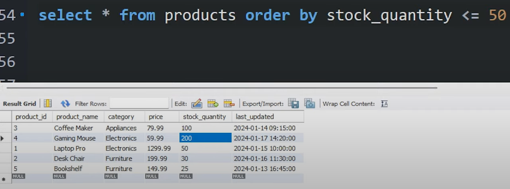
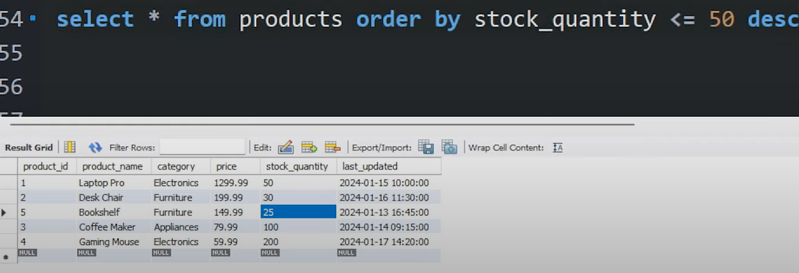

## 🔶 1. `ORDER BY LENGTH(column)` — Sort by Text Length

### ✅ Purpose:

Sort rows by the length of a string.

### 📌 Example:

```sql
SELECT product_name, category
FROM products
ORDER BY LENGTH(product_name);
```

### 🧠 Explanation:

This orders the products based on how many characters are in the `product_name`. Useful when you want to identify:

* Very short or long names
* Formatting issues (e.g., unusually long input)

### 🧾 Output Example:

| product\_name | Length |
| ------------- | ------ |
| Mouse Pad     | 9      |
| USB Cable     | 9      |
| Desk Chair    | 10     |
| Air Fryer     | 10     |
| Book Shelf    | 11     |
| Laptop Pro    | 11     |

---

## 🔶 2. `ORDER BY` on Date/Time Columns

### ✅ Purpose:

Sort data based on when it was **created**, **updated**, or any **timestamp**.

### 📌 Example:

```sql
SELECT product_name, last_updated
FROM products
ORDER BY last_updated DESC;
```

### 🧠 Explanation:

Sorts with the **most recently updated** product first.

---

### 🔁 With `DATE()` function (strip time):

```sql
SELECT product_name, last_updated
FROM products
ORDER BY DATE(last_updated) DESC;
```

---

## 🔶 3. `FIELD()` — Custom Order (like `CASE`, but shorter)

### ✅ Purpose:

You define a **manual order** for non-numeric, unordered values.

### 🧾 Example Table:

| product\_name | category    |
| ------------- | ----------- |
| USB Cable     | electronics |
| Desk Chair    | Furniture   |
| Air Fryer     | appliances  |
| Book Shelf    | Appliances  |

---

### 📌 Query:

```sql
SELECT product_name, category
FROM products
ORDER BY FIELD(category, 'Furniture', 'Electronics', 'Appliances');
```

### 🧠 Explanation:

* `'Furniture'` comes first
* Then `'Electronics'`
* Then `'Appliances'` (case-sensitive!)

---

## 🔶 4. Sort by **Low Stock but High Price** = Best Deals

### ✅ Real-world use case:

Show **low-stock**, **high-value** items at the top to promote urgent sales.

### 📌 Query:

```sql
SELECT product_name, stock_quantity, price
FROM products
ORDER BY stock_quantity ASC, price DESC;
```

### 🧠 Explanation:

* First sorted by `stock_quantity ASC` → low stock first
* Within same stock, sorted by `price DESC` → high price first

---

### 🔁 Variation: Only show stock under 30 and high price

```sql
SELECT product_name, stock_quantity, price
FROM products
WHERE stock_quantity <= 30 AND price >= 100
ORDER BY stock_quantity ASC, price DESC;
```

---

## 🔶 5. Sort Using Mathematical Expressions

### 📌 Example: `price per unit`

If you had a `weight` column:

```sql
SELECT product_name, price / weight AS price_per_kg
FROM products
ORDER BY price_per_kg;
```

---

## 🔶 6. Sorting with Aggregates (GROUP BY + ORDER BY)

Let’s say you want to find categories with highest total stock:

```sql
SELECT category, SUM(stock_quantity) AS total_stock
FROM products
GROUP BY category
ORDER BY total_stock DESC;
```

---

## 🔶 7. `ORDER BY` with Subqueries and Aliases

```sql
SELECT *
FROM (
    SELECT product_name, stock_quantity, price, price / stock_quantity AS value_score
    FROM products
) AS deals
ORDER BY value_score DESC;
```

### 🧠 Explanation:

Ranks products by how "valuable" they are per unit in stock.

---

## 🔶 8. Combine ORDER BY with LIMIT + OFFSET (Pagination)

```sql
SELECT product_name, price
FROM products
ORDER BY price ASC
LIMIT 10 OFFSET 20;
```

Shows products ranked **21 to 30** by lowest price.

---

## ✅ Summary Table

| Feature                 | Query Snippet                                      |
| ----------------------- | -------------------------------------------------- |
| Text length sort        | `ORDER BY LENGTH(name)`                            |
| Date sorting            | `ORDER BY last_updated DESC`                       |
| Custom sort (manual)    | `ORDER BY FIELD(category, 'A', 'B', 'C')`          |
| Best deal sorting       | `ORDER BY stock ASC, price DESC`                   |
| Math expression sorting | `ORDER BY price / weight`                          |
| Aggregate-based sorting | `GROUP BY ... ORDER BY SUM(...)`                   |
| Derived column sort     | `SELECT ... price / stock AS score ORDER BY score` |
| Pagination              | `LIMIT 10 OFFSET 20`                               |


---
---
---


```sql
ORDER BY stock_quantity <= 50 [ASC | DESC]
```

Let me explain what's **actually happening** here in detail — because it's subtle and a bit tricky:

---

## ✅ **Key Point:**

You're not ordering by `stock_quantity` directly.
You're ordering by the **result of this expression**:

```sql
stock_quantity <= 50
```

Which is a **Boolean condition**, not a number.

---

## 🧠 What does `stock_quantity <= 50` return?

It returns:

* `1` (true) if stock\_quantity is **≤ 50**
* `0` (false) if stock\_quantity is **> 50**

---

## 🔍 First Image:



```sql
SELECT * FROM products ORDER BY stock_quantity <= 50;
```

This is equivalent to:

```sql
ORDER BY (stock_quantity <= 50) ASC;
```

→ Sort by:

* `FALSE` (0) → comes first
* `TRUE` (1) → comes later

### Output Order by the Boolean:

| stock\_quantity | `<= 50` |
| --------------- | ------- |
| 200             | 0       |
| 100             | 0       |
| 50              | 1       |
| 30              | 1       |
| 25              | 1       |

➡ That's why **200 and 100 come first** — their condition is **false (0)**.

---

## 🔍 Second Image:



```sql
SELECT * FROM products ORDER BY stock_quantity <= 50 DESC;
```

This is equivalent to:

```sql
ORDER BY (stock_quantity <= 50) DESC;
```

Now you're saying:

* Put `TRUE` (1) values **first**
* Put `FALSE` (0) values **later**

### Output Order by the Boolean:

| stock\_quantity | `<= 50` |
| --------------- | ------- |
| 50              | 1       |
| 30              | 1       |
| 25              | 1       |
| 100             | 0       |
| 200             | 0       |

➡ You’re still **not sorting within the "true" group** (`50, 30, 25`).

---

## ❗ Important Clarification:

You are **not ordering by stock quantity**, you are ordering by whether or not it satisfies a condition.

---

## ✅ How to get what you actually want:

If you want the rows where stock ≤ 50, sorted **by stock\_quantity ASC**, use:

```sql
SELECT * FROM products
WHERE stock_quantity <= 50
ORDER BY stock_quantity ASC;
```

Or if you don’t want to filter but still want the lowest quantities first among all rows:

```sql
SELECT * FROM products
ORDER BY stock_quantity ASC;
```

If you want to **first prioritize items with stock ≤ 50**, and **within that**, sort by actual stock value:

```sql
SELECT * FROM products
ORDER BY (stock_quantity <= 50) DESC, stock_quantity ASC;
```

---

## 🎯 Visual Explanation of Correct Query:

```sql
ORDER BY (stock_quantity <= 50) DESC, stock_quantity ASC;
```

| stock\_quantity | `<= 50` | (priority group) | Final order |
| --------------- | ------- | ---------------- | ----------- |
| 25              | 1       | first group      | ✅           |
| 30              | 1       | first group      | ✅           |
| 50              | 1       | first group      | ✅           |
| 100             | 0       | second group     | ✅           |
| 200             | 0       | second group     | ✅           |

---

## ✅ Summary:

| Expression                           | What it does                             |
| ------------------------------------ | ---------------------------------------- |
| `ORDER BY stock_quantity ASC`        | Sorts by actual values                   |
| `ORDER BY stock_quantity <= 50`      | Sorts by condition: false (0) → true (1) |
| `ORDER BY stock_quantity <= 50 DESC` | True (1) → false (0)                     |
| `ORDER BY (condition), column`       | Groups by condition, sorts within group  |


---
---
---


### ✅ You wrote:

```sql
SELECT * FROM products 
ORDER BY (stock_quantity <= 50 AND price >= 200);
```

This means you're **ordering the rows based on the result of a Boolean condition**:

```sql
(stock_quantity <= 50 AND price >= 200)
```

This condition will return:

* `1` (true) **only if both**:

  * `stock_quantity <= 50`
  * `price >= 200`
* Otherwise, `0` (false)

---

### 🔍 Example Table:

Assume this `products` table:

| id | name      | stock\_quantity | price |
| -- | --------- | --------------- | ----- |
| 1  | Product A | 200             | 150   |
| 2  | Product B | 50              | 250   |
| 3  | Product C | 30              | 180   |
| 4  | Product D | 25              | 210   |
| 5  | Product E | 100             | 300   |

---

### 🧠 Evaluating the condition `(stock_quantity <= 50 AND price >= 200)`:

| id | stock\_quantity | price | Condition `<=50 AND >=200` | Result |
| -- | --------------- | ----- | -------------------------- | ------ |
| 1  | 200             | 150   | ❌ False                    | 0      |
| 2  | 50              | 250   | ✅ True                     | 1      |
| 3  | 30              | 180   | ❌ False (price < 200)      | 0      |
| 4  | 25              | 210   | ✅ True                     | 1      |
| 5  | 100             | 300   | ❌ False (stock > 50)       | 0      |

---

### 📊 ORDER BY (stock\_quantity <= 50 AND price >= 200)

* You are **ordering based on 0 or 1**
* Default `ORDER BY` is **ASC** (0 comes first, 1 comes later)

So final output:

| id | name      | Condition Result |
| -- | --------- | ---------------- |
| 1  | Product A | 0                |
| 3  | Product C | 0                |
| 5  | Product E | 0                |
| 2  | Product B | 1                |
| 4  | Product D | 1                |

---

### ✅ If you write:

```sql
ORDER BY (stock_quantity <= 50 AND price >= 200) DESC;
```

Then you **prioritize best deals** first (those satisfying both conditions):

| id | name      | Condition Result |
| -- | --------- | ---------------- |
| 2  | Product B | 1                |
| 4  | Product D | 1                |
| 1  | Product A | 0                |
| 3  | Product C | 0                |
| 5  | Product E | 0                |

---

### 🎯 To make this more powerful:

You can add further sorting within the condition:

```sql
SELECT * FROM products 
ORDER BY (stock_quantity <= 50 AND price >= 200) DESC, price ASC;
```

This:

1. Prioritizes best deal products
2. Sorts them by lowest price (within the deals)

---

### ✅ Summary

| Clause                       | Effect                                   |
| ---------------------------- | ---------------------------------------- |
| `ORDER BY condition`         | Orders by Boolean value (0 or 1)         |
| `AND` used inside `ORDER BY` | Combines conditions for better targeting |
| `DESC`                       | Puts matching rows (true/1) at the top   |


---
---
---


### 🧠 Original Logic (Boolean in `ORDER BY`):

```sql
ORDER BY (stock_quantity <= 50 AND price >= 200) DESC;
```

This is great but **not very readable**. So let’s rewrite it using `CASE`.

---

## ✅ Using `CASE` in `ORDER BY`

```sql
SELECT * FROM products
ORDER BY 
  CASE 
    WHEN stock_quantity <= 50 AND price >= 200 THEN 1
    ELSE 0
  END DESC;
```

### 🔍 Explanation:

* `CASE` returns `1` if a product is a **"best deal"**:

  * Low stock (≤ 50)
  * High price (≥ 200)
* Products that **match the deal** go to the top (because of `DESC`)
* Others go below

---

## 🧪 Add Secondary Sorting with `CASE`

Let’s say within the best deals you want to sort by **lowest price first**:

```sql
SELECT * FROM products
ORDER BY 
  CASE 
    WHEN stock_quantity <= 50 AND price >= 200 THEN 1
    ELSE 0
  END DESC,
  price ASC;
```

---

## 📦 Full Use Case with Labels (Advanced)

Let’s say you want to sort in this order:

1. **Best deals**: low stock, high price
2. **Mid deals**: low stock, low price
3. **Rest**: high stock

You can label them using `CASE`:

```sql
SELECT *, 
  CASE
    WHEN stock_quantity <= 50 AND price >= 200 THEN 'Best Deal'
    WHEN stock_quantity <= 50 THEN 'Mid Deal'
    ELSE 'Regular'
  END AS deal_type
FROM products
ORDER BY 
  CASE
    WHEN stock_quantity <= 50 AND price >= 200 THEN 1
    WHEN stock_quantity <= 50 THEN 2
    ELSE 3
  END,
  price ASC;
```

---

### ✅ Output:

This will:

* Group your products: Best → Mid → Regular
* Sort each group by price

---

### 🔚 Summary

| `CASE` in `ORDER BY`                           | Use When |
| ---------------------------------------------- | -------- |
| For **complex multi-condition** sorting        | ✅        |
| When sorting needs **custom labels or groups** | ✅        |
| Makes sorting **clear and flexible**           | ✅        |


---
---
---


## 🔹 What is `SELECT *, something_else`?

```sql
SELECT *, price * 2 AS double_price FROM products;
```

* Here, `*` gets **all columns**, and then you're **adding a new column** to the result.
* `price * 2` is a **computed column**, given an alias `double_price`.

---

### ✅ Example Output:

| product\_id | name   | price | stock\_quantity | double\_price |
| ----------- | ------ | ----- | --------------- | ------------- |
| 1           | Phone  | 500   | 20              | 1000          |
| 2           | Laptop | 1200  | 50              | 2400          |
